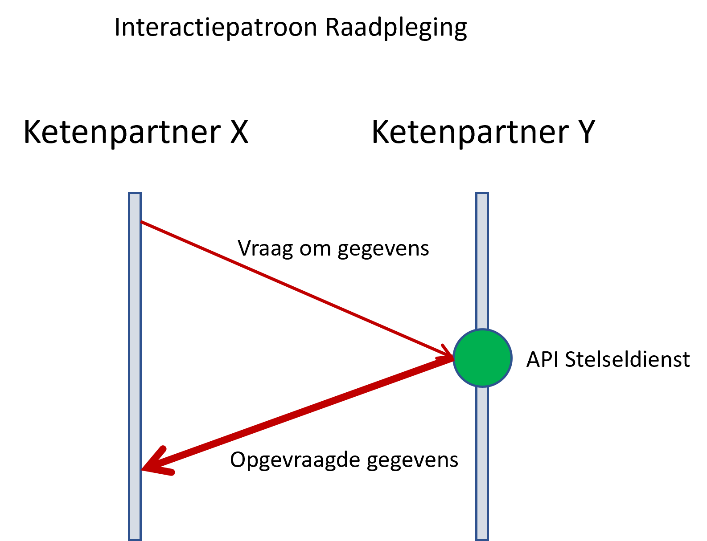
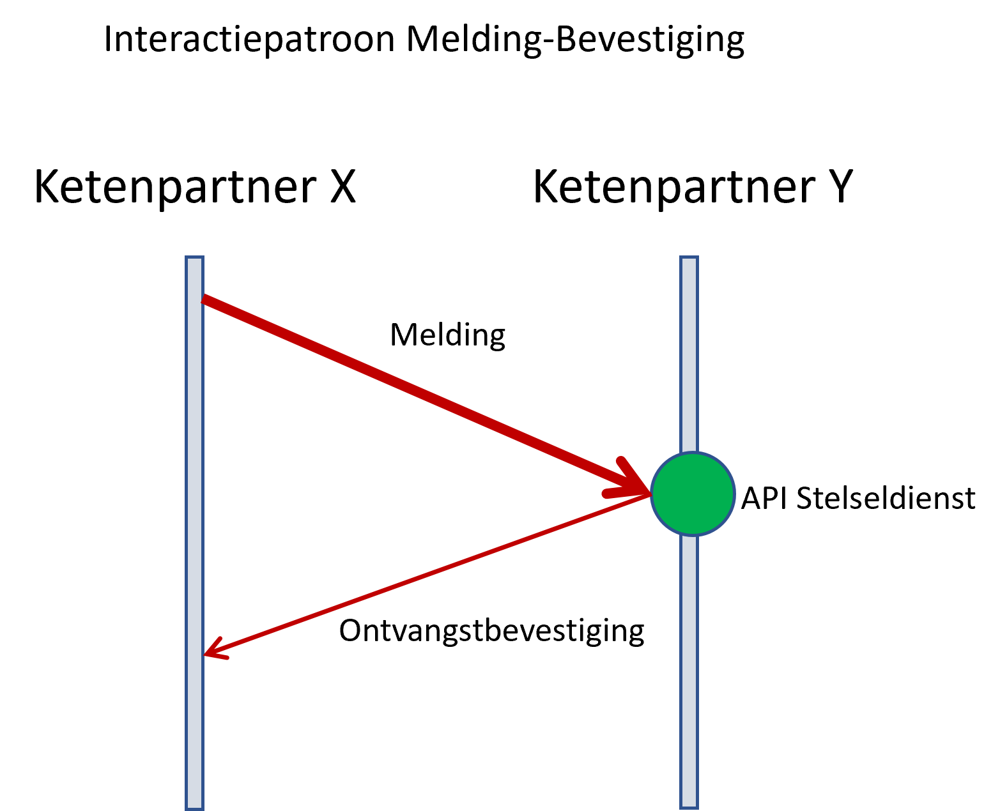
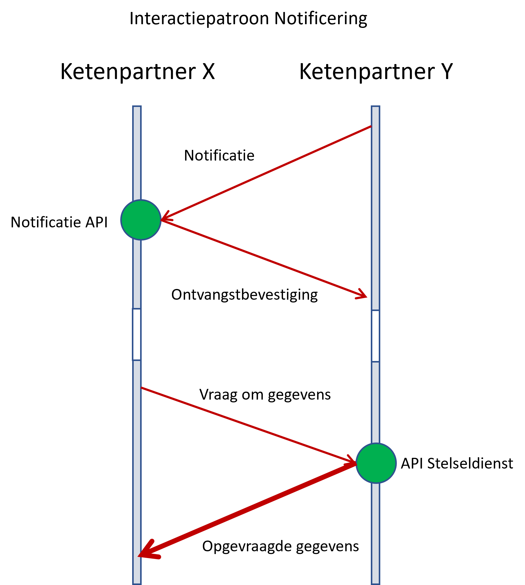

Een interactiepatroon is een beschrijving van de standaard manier waarop twee partijen met elkaar communiceren. In deze gegevensuitwisseling gaat het om de communicatie tussen systemen van twee organisaties of ketenpartners (M2M).

In de ketenarchitectuur Inburgering zijn drie standaard interactiepatronen beschreven:

[TOC]

# Raadpleging
{width=30%}

Patroon voor het opvragen/raadplegen van gegevens waarbij een vraag direct (synchroon) leidt tot een antwoord. De vraagsteller neemt het initiatief en wacht op het antwoord.

Voorbeeld ten aanzien van de inburgeringstermijn:

- Gemeente -> vraag: “wat is de vastgestelde inburgeringstermijn van inburgeraar X”
- DUO -> antwoord: “de datum einde termijn van inburgeraar X is 1 januari 2025”

# Melding-Bevestiging
{width=30%}

Dit interactiepatroon geldt voor alle gegevensuitwisselingen waar gemeenten bronhouder is en DUO afnemer. Gemeenten nemen het initiatief om aan DUO te melden dat er in hun domein een gebeurtenis is opgetreden, die relevant is voor het ketenproces. Met als doel om DUO in staat te stellen om de gegevens te verwerken.

De bronhouder doet dit door de API van DUO aan te roepen die bij de gebeurtenis hoort. Om DUO te informeren over een gebeurtenis stuurt de gemeente een melding.

Melding:

- Een bericht waarop eventueel enige tijd later een retour-melding volgt (Digikoppeling definitie)
- De door een gemeente aan DUO verstrekte informatie naar aanleiding van een binnen zijn domein plaatsgevonden gebeurtenis.
- Een melding is informatierijk, deze bevat alle gegevens die nodig zijn voor de verwerking door de afnemer.
- De gemeente neemt het initiatief en wacht niet op het resultaat van verwerking door DUO. DUO verwerkt de gegevens en gebruikt het notificeringspatroon om het resultaat te melden. 

Dit patroon voldoet niet aan het uitgangspunt dat de bronhouder de API’s levert voor het opvragen en wijzigen van zijn brongegevens. En het voldoet niet volledig aan het principe 'gegevens bij de bron' door ontbreken van raadpleeg API’s aan gemeentekant.

Waarom dan toch hiervoor gekozen? De rationale: is robuustheid van de keten & kosten:

- Bevordert koppelvlakstandaardisatie en vereenvoudigt versiebeheer bij n bronhouders en één afnemer: 1 API bij DUO versus n API’s in gemeentelijk domein;
- Lagere administratieve last om endpoints, versies etc te registreren;
- Minder ontwikkel- en beheerinspanning in de keten.

Voorbeeld PIP:

- Gemeente -> melding “hier zijn de PIP-gegevens van inburgeraar X”
- DUO -> ontvangstbevestiging “oké, ik ga ermee aan de slag”

# Notificering
{width=30%}

Bronhouders nemen het initiatief om afnemers met een notificatie te informeren over een systeemgebeurtenis die mogelijk relevant is voor hun afnemers. Met als doel om afnemers in staat te stellen om gegevens op te vragen bij de bronhouder en eigen afhandelingsprocessen te starten.

Notificatie = de door een bronhouder aan afnemers verstrekte informatie over een binnen zijn domein plaatsgevonden systeemgebeurtenis

Systeemgebeurtenis = de representatie van iets dat gebeurd is in het systeem van de aanbieder/bronhouder:

- Een wijziging in het systeem
- Een signalering dat iets ontbreekt, mogelijk niet klopt, nog moet gebeuren of gaat gebeuren

DUO stuurt als bronhouder een notificatie naar de desbetreffende gemeente. De ontvanger van de notificatie vraagt gegevens op bij de bronhouder door de relevante API's van de bronhouder aan te roepen die bij de gebeurtenis hoort.

Dit interactiepatroon geldt voor alle stelseldiensten waar DUO leverancier is van de gegevens.

Voor het versturen en ontvangen van notificaties is een Notificatie API nodig.

Voordelen:

- Afnemers hoeven niet zelf initiatief te nemen om DUO te bevragen. Onnodig berichtenverkeer wordt voorkomen.
- Afnemer kan zelf bepalen of en wanneer de gegevens worden opgevraagd
- Afnemer beschikt over de actuele gegevens op het moment dat hij het nodig heeft

Voorbeeld SDI007 Inburgeringstermijn:

- DUO -> Notificatie “de inburgeringstermijn van inburgeraar X is vastgesteld”
- Gemeente -> Ontvangstbevestiging: “oké, ontvangen”
- Gemeente -> Vraag: “wat is de vastgestelde inburgeringstermijn van inburgeraar X”
- DUO -> Antwoord “de datum einde termijn van inburgeraar X is 1 januari 2025”